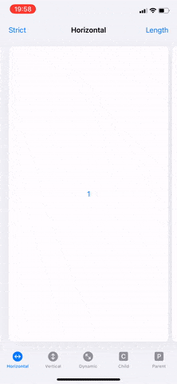

# SwiftUI PageView

SwiftUI stack views with paged scrolling behaviour.



## HPageView
A view that arranges its children in a horizontal line, and provides paged scrolling behaviour.

### Usage
```swift
HPageView(alignment: .leading, pageWidth: 250, spacing: 12) {
    //Pages
}
```

### Parameters
* `alignment`: The guide for aligning the pages in this page view.
* `pageWidth`: The width of each page, or `nil` if you want each page to fill the width of the page view.
* `spacing`: The distance between adjacent pages, or `nil` if you want the page view to choose a default distance for each pair of pages.
* `content`: A view builder that creates the content of this page view.

## VPageView
A view that arranges its children in a vertical line, and provides paged scrolling behaviour.

### Usage
```swift
VPageView(alignment: .top, pageHeight: 250, spacing: 12) {
    //Pages
}
```

### Parameters
* `alignment`: The guide for aligning the pages in this page view.
* `pageHeight`: The height of each page, or `nil` if you want each page to fill the height of the page view.
* `spacing`: The distance between adjacent pages, or `nil` if you want the page view to choose a default distance for each pair of pages.
* `content`: A view builder that creates the content of this page view.

## PageView
A view that arranges its children in a line, and provides paged scrolling behaviour.

**Changes to the layout axis will cause the pages to lose their state, and will not be animated.**

### Usage
```swift
PageView(.horizontal, alignment: .leading, pageLength: 250, spacing: 12) {
    //Pages
}
```

### Parameters
* `axis`: The layout axis of this page view.
* `alignment`: The guide for aligning the pages in this page view.
* `pageHeight`: The length of each page, parallel to the layout axis, or `nil` if you want each page to fill the length of the page view.
* `spacing`: The distance between adjacent pages, or `nil` if you want the page view to choose a default distance for each pair of pages.
* `content`: A view builder that creates the content of this page view.

## PageViewReader
A view that provides programmatic paging, by working with a proxy to move to child pages.

### Usage
```swift
PageViewReader { proxy in
    HPageView {
        //Pages
          .onTapGesture {
              proxy.moveToFirst()
          }
    }
}
```

### Parameters
* `content`: The reader's content, containing a page view.

## PageViewProxy
A proxy value that supports programmatic paging of the first page view within a view hierarchy.

### Parameters
* `moveTo(index:)`: Scans the first page view contained by the proxy for the page with the index closest to `index`, and then moves to that page.
* `moveToFirst()`: Scans the first page view contained by the proxy for the first page, and then moves to that page.
* `moveToLast()`: Scans the first page view contained by the proxy for the last page, and then moves to that page.

## Advanced Usage
The `strictPageAlignment` view modifier can be used to control whether page views always use their provided alignment to position pages. Without this modifier pages will be aligned to prevent leaving empty space in the page view.

## Requirements

* iOS 14.0+ or watchOS 7.0+
* Xcode 12.0+

## Installation

* Install with [Swift Package Manager](https://developer.apple.com/documentation/xcode/adding_package_dependencies_to_your_app).
* Import `SwiftUIPageView` to start using.

## Contact

[@ciaranrobrien](https://twitter.com/ciaranrobrien) on Twitter.
